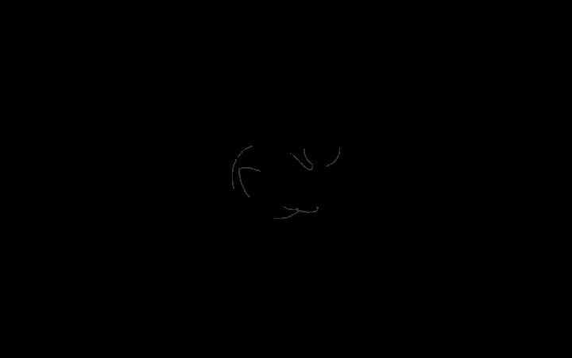

# DSH 桌面版启动动画 + UI 入场过渡

> SteamOS 风格的七段启动分镜，以及 DSH 桌面端 UI 的「由外向内、环环平移」入场过渡。
> **零依赖 · 零源码改动 · 可一键还原。**



<p align="center"><sub>↑ 黑屏 → 鲸鱼 → 双线内合 → 轮廓勾勒 → 中线展开 → 落白 → UI 环环入场（约 5.6 秒，此处 10fps 采样）</sub></p>

---

## 目录

- [为什么这样做](#为什么这样做)
- [七段分镜](#七段分镜)
- [快速开始](#快速开始)
- [鲸鱼轮廓](#鲸鱼轮廓)
- [UI 入场过渡](#ui-入场过渡)
- [动效令牌](#动效令牌)
- [安全网与降级](#安全网与降级)
- [文件结构](#文件结构)
- [开发](#开发)
- [已验证 / 未验证](#已验证--未验证)
- [参考来源](#参考来源)
- [许可](#许可)

---

## 为什么这样做

DSH 桌面版运行时只加载 `app.asar`；`resources/app/` 那个看似「解包副本」的目录**根本不会被加载**。
所以能改的地方只有三条路，本方案选第三条：

| 候选 | 为什么不选 |
|---|---|
| 解包重打包 `app.asar` | 每次 DSH 自动更新都会覆盖；121 MB 重打包有损坏安装的风险；难以干净回滚 |
| 改 `resources/app/` | 该目录是陈旧副本，改了完全不生效 |
| **宿主侧插件 + index 注入** ✅ | 走 DSH 官方插件契约，更新后不失效；不碰任何原始文件；卸载即还原 |

决定性的发现是桌面版加载链路的一个特点：

````
resources/app.asar/lib/main.js
  ├─ serveWebDocument()
  │    直接 readFile(dist/index.html)，不调用 renderIndex()
  │    只在 <head> 里塞一行 __DSH_BOOT_READY__
  └─ DESKTOP_IPC.boot 返回 { injections, streamBaseUrl }
               ↑ 值来自 ctx.webServer.collectIndexInjections()
````

**桌面版虽然不把注入行渲染进 HTML，但会把同一张行表通过 IPC 交给页面**，
由前端解释器逐行执行。因此只要往 `collectIndexInjections()` 的表里 push 行，
注入就行之有效——无论内容多长，也无论有没有 HTTP 路由。

这就是宿主半侧只有 30 行的原因。

---

## 七段分镜

| # | 画面 | 实测时间窗 |
|---|---|---|
| ① | 黑屏 | 0 – ~0.5s |
| ② | 屏幕中央出现鲸鱼 | ~0.2 – ~0.9s |
| ③ | 转全黑，两条线由左右两侧向中间延伸 | ~0.95 – ~1.4s |
| ④ | 两线构筑成鲸鱼，并勾出与侧边栏图标一致的轮廓 | ~1.4 – ~2.15s |
| — | *收笔后停住，等应用真正挂载* | ~2.15 – ~3.3s |
| ⑤ | 中央横线向上下两侧展开，画面一分为二 | ~3.3 – ~4.2s |
| ⑥ | 展开同时鲸鱼缓缓消失，露出默认白底 / 已装配皮肤 | ~3.45 – ~4.2s |
| — | *缓冲过场：鲸鱼重组左移 → 官方字标浮现 → 光带等待后端* | ~2.2 – ~4.2s |
| ⑦ | UI 以由外向内、环环平移的方式入场 | ~4.3 – ~5.3s |
| | **总时长** | **≈ 5.6s** |

第 ④ 段收笔后**不立刻揭幕**，而是等应用真正挂载（最长 9 秒）。
这样慢启动不会「动画放完露空白」，快启动也不会「UI 早好了还压着黑幕」。

时长取 5.6 秒而非掌机档的 4 秒，依据是本机 Steam 客户端实测：官方**桌面场景**开机动画
`steam_os_startup.webm` = 5.000s / 1920×1200，而 `deck_startup.webm` 的 4.008s 只是掌机档位。

---

## 快速开始

### 安装

````powershell
# 在本仓库根目录执行
powershell -ExecutionPolicy Bypass -File install.ps1
````

然后**重启「DeepSeek Harness」桌面应用**。

脚本会：备份 profile 的 `package.json` → 加一条 `link:` 依赖 → 往 `dsh.profile.bundles` 追加本包 →
在 `node_modules/@local/` 建 junction。它**不触碰 DSH 安装目录**。

可用参数覆盖路径：

````powershell
.\install.ps1 -PluginDir "D:\somewhere\dsh-boot-anim" -ProfileDir "$env:USERPROFILE\.dsh\profiles\desktop"
````

### 卸载

````powershell
powershell -ExecutionPolicy Bypass -File uninstall.ps1
````

### 不重启也能看动画

无头 Chromium 跑的是**同一份 CSS / JS**：

````powershell
powershell -ExecutionPolicy Bypass -File verify-headless.ps1
````

需要 Playwright。可用 `-PlaywrightEntry` 或 `DSH_PLAYWRIGHT` 环境变量指定它的位置：

````powershell
.\verify-headless.ps1 -PlaywrightEntry "D:\path\to\playwright\index.mjs"
````

逐帧截图会写到 `_verify/f*.png`。

---

## 鲸鱼轮廓

需求要求轮廓与现有图标一致，做法是**直接把原 path 抄过来**，不是照着重画：

- **来源**：`@deepseek-ai/dsh-client-ui-primitives` 的 `FISH_LOGO_PATH`
- **规格**：3448 字符；4 条子路径（`M…C…Z`）；`viewBox="0 0 23.16 17.04"`
- **校验锚点**：`_verify/fish-logo-path.txt` 保存逐字节副本，CI 会核对二者一致

侧边栏图标与对话区 hero 用的是**同一个** `FishLogo` 组件，所以「与图标一致」是构造性成立的。

### 两个几何上的取舍

**同一段 path 画两遍。** 分镜 ④ 要让「两条线分别构筑」，做法是把同一段 `d` 渲染两次，
各套一个 `clipPath`：`#ba-clip-l` 只留 `x < 11.58`，`#ba-clip-r` 只留 `x > 11.58`。
两条路径的 `stroke-dashoffset` **反向**（`-1 → 0` 与 `+1 → 0`），
于是描边从中间同时向两端铺开。

**压扁时描边不能变细。** ③ 与 ④ 需要同一个元素从「一条横线」连续变形成鲸鱼轮廓：
鲸鱼组套 `scaleY(0.018)` 压成约 2px 的横线，再 `scaleY: 0.018 → 1` 长成鲸鱼。
但压扁会把描边一起压细到看不见——解法是 `vector-effect: non-scaling-stroke`，
描边宽度不随 transform 缩放，压平时它仍是一条实心横线。这样 ③ 与 ④ 不必切换 DOM。

---

## 缓冲过场

在「轮廓勾勒完成」与「横线展开」之间插了一段过场：鲸鱼淡出重组、左移让位，
官方字标在其右侧浮现；若后端仍在加载，一道斜向光带反复扫过字面。

### 字标用的是官方矢量

不是文字排版，而是直接从上游 `dsh-client-ui-primitives` 的 `BrandWordmark`
组件提取的矢量数据：**18 个图元 / 13931 字符 path / 2 处裁剪框**，
由 `_verify/gen-wordmark.mjs` 自动生成并断言结构。手抄这 1.4 万字符不可能不出错。

数据经 `global` 注入行送进页面 —— `boot-anim.js` 是注入的独立脚本，无法 `import`。

### 光带的实现

光带层是字标的**同形副本**，被一道移动的遮罩裁切：只有光带扫过的部分才高亮出来。

这里有两个坑，都是实测才发现的：

- **不能用 `mix-blend-mode: screen`** —— 屏幕混合下「白叠白」恒为白，等于没有效果；
- **定位必须与字标层完全一致** —— 曾因写成 `inset: 0` 而铺满容器，
  导致字标副本被放大 3.46 倍、跑到左上角（看起来像两个巨大的汉字）。

另外「加载期间压暗字标」也踩过一次：内联样式会被入场动画的
`fill: 'forwards'` 终值覆盖（实测 `inline 0.22` 而 `computed 1`），
必须改用 WAAPI 动画才能压下去。

详见 [docs/04 第 9 节](docs/04-验证结果.md)。

---

## UI 入场过渡

### 没有稳定类名怎么找 UI 分区

DSH 前端是 CSS Modules（hash 类名）+ 打包产物，**没有可挂钩的类名**。链条是：

````
document.querySelector('[data-shell-overlay]')   ← AppFrame 里唯一的语义锚点
        .parentElement                            ← 就是 AppFrame 的三列 grid 容器
        .children → 按 getBoundingClientRect().left 排序
                 → 最左 = 侧边栏、中间 = 对话列、最右 = 右栏
````

### 三段波次

| 波次 | 目标 | 方向 | 位移 | 时长 | 交错 | 起始延迟 |
|---|---|---|---|---|---|---|
| 1 | 外层三列 | 左栏向左、右栏向右、中列向上 | 40px | 460ms | — | 0 / 70 / 140ms |
| 2 | 列内主块 | 自下浮起 | 26px | 380ms | 60ms | — |
| 3 | 主块内内容块 | 自下浮起 | 16px | 320ms | 40ms | — |

合计约 730ms，落在「总交错 < 800ms」的通行区间内。

### 一个会静默失效的坑

`[data-slot]` 锚点的样式是 **`display: contents`** ——

````js
/** Anchor style shared by every outlet wrapper: display:contents keeps the
  * wrapper out of layout ... so the anchor is purely addressable surface. */
const ANCHOR_STYLE = { display: "contents" };
````

**没有盒子**，`getBoundingClientRect()` 返回全 0。拿它做动画目标等于空操作，
**而且不报错**。本实现用 `collectBlocks()` 穿透这类中间层往下钻，只收「有盒子且够大」的元素。

---

## 动效令牌

所有曲线与时长集中在 `lib/boot-anim.js` 顶部的 `T` 表，每一项目标都有出处：

````js
var T = {
  ENTER:  'cubic-bezier(0.23, 1, 0.32, 1)',   // emilkowalski/skills 的 --ease-out
  IN_OUT: 'cubic-bezier(0.77, 0, 0.175, 1)',  // 同上的 --ease-in-out
  DRAW:   'cubic-bezier(0.22, 1, 0.36, 1)',   // mblode/agent-skills 的 Enter
  // …
}
````

采用的三条硬规则：

- **进场一律 ease-out 家族**，绝不用 ease-in —— 后者起步慢，正好拖慢用户最关注的那一刻。
- **只动 `transform` 与 `opacity`** —— 两者都在合成层，不触发布局与重绘。
- **数值不凭手感编** —— 每个曲线和时长都来自 [参考来源](#参考来源) 里的表。

想调快调慢，改这个表即可，不必翻实现。

---

## 安全网与降级

| 情形 | 行为 |
|---|---|
| `prefers-reduced-motion: reduce` | CSS 里 `display: none !important`；JS 里直接结束，不播放 |
| 用户在动画中按键 / 点击 / 滚轮 | 立即跳到揭幕，不阻断操作 |
| 任何一环抛异常 | `finally` 里必定清理，界面绝不永久压在黑幕下 |
| 总时长超 20 秒 | 兜底定时器强制跳过 |
| `Element.animate` 不可用 | 逐项跳过，不卡住 |
| 注入晚于 React 首次挂载 | 舞台 `z-index` 极高 + 等待 UI 就绪，最差是 UI 闪一帧后被覆盖 |

终态**没有任何 DOM 残留**（舞台整体移除），露出的是真实 UI 本身，
所以「露出的皮肤」在构造上就等于「已装配的皮肤」，不存在样式回退问题。
颜色只从 `var(--dsw-alias-bg-base, #fff)` 取，不硬编码。

---

## 文件结构

````
dsh-boot-anim/
├── package.json                 插件包声明（dsh.bundle.patch）
├── cordis.patch.yml             loader patch：insert 进 desktop profile
├── install.ps1 / uninstall.ps1  安装与卸载
├── verify-headless.ps1          一键无头复现
├── LICENSE  CHANGELOG.md  SECURITY.md
├── .github/
│   ├── workflows/verify.yml     语法 / 单测 / 结构 / 敏感信息
│   ├── ISSUE_TEMPLATE/
│   └── PULL_REQUEST_TEMPLATE.md
├── lib/
│   ├── index.js                 宿主半侧：订阅 webserver/index-inject
│   ├── boot-anim.css            舞台样式（作用域前缀，不碰应用类名）
│   └── boot-anim.js             前端半侧：七段分镜 + 三段波次（零依赖 IIFE）
├── docs/
│   ├── 01-方案检索清单.md        检索到的方案与来源链接
│   ├── 02-UI入场动画技术对比.md  六种挂钩方式对比与本机实测
│   ├── 03-技术选型与实现.md      选型理由与改动清单
│   ├── 04-验证结果.md            时序实测、逐帧截图、未验证项
│   ├── media/                    演示 GIF / 视频 / 封面
│   └── _verify/                  技术对比文档的验证资产
└── _verify/
    ├── run.mjs                   无头逐帧采样
    ├── record.mjs                录制演示视频
    ├── test-host.mjs             宿主半侧单测
    ├── probe-loader.mjs          用真实加载器验证 bundle 被接受
    ├── probe-e2e.mjs             用真实 cordis 跑端到端
    ├── check-structure.mjs       结构完整性 + 敏感信息扫描
    ├── render-all-frames.mjs     全量逐帧渲染（供逐帧检视）
    ├── gen-wordmark.mjs          从上游提取官方字标矢量
    ├── diag-sheen.mjs            两层几何是否重合
    ├── diag-opacity.mjs          压暗是否生效
    ├── diag-progress.mjs         鲸鱼与字标是否重叠
    └── fish-logo-path.txt        鲸鱼 path 校验锚点
````

---

## 开发

````bash
# 语法检查
node --check lib/index.js && node --check lib/boot-anim.js

# 宿主半侧单测
node _verify/test-host.mjs

# 结构与敏感信息检查（CI 同款）
node _verify/check-structure.mjs

# 用真实加载器验证 bundle 能被解析
ELECTRON_RUN_AS_NODE=1 "<DSH>/DeepSeek Harness.exe" _verify/probe-loader.mjs

# 用真实 cordis 跑端到端
ELECTRON_RUN_AS_NODE=1 "<DSH>/DeepSeek Harness.exe" _verify/probe-e2e.mjs
````

两个探针需要显式给出路径（本机会把 `HOME` / `USERPROFILE` 改写）：

````powershell
$env:DSH_RESOURCES = "$env:LOCALAPPDATA\Programs\DeepSeek Harness\resources"
$env:DSH_PROFILE   = "$env:USERPROFILE\.dsh\profiles\desktop"
````

---

## 已验证 / 未验证

**已验证**（无头 Chromium 154，跑的是即将上线的同一份 CSS / JS）：

- 七段分镜顺序与时序，18 个采样点覆盖全部镜头
- 第 ④ 段鲸鱼轮廓可辨识，与侧边栏图标是同一条 path
- 舞台自毁、无 DOM 残留、无标记残留、控制台零报错
- UI 三段波次目标数 `{cols: 3, inner: 5, deeper: 2}`
- 真实加载器：25 个 bundle 全部接受、0 跳过
- 真实 cordis 端到端：12/12 断言通过
- 安装 / 卸载往返：profile 正确改写与回滚，无 BOM

**未验证**（如实标注，不从等价验证外推）：

- 真实 DSH 桌面窗口中的最终观感 —— 需重启桌面版
- 真实桌面版的 IPC 往返时机 —— 同上

---

## 参考来源

完整清单见 [docs/01-方案检索清单.md](docs/01-方案检索清单.md)。核心来源：

- [mblode/agent-skills · ui-animation](https://github.com/mblode/agent-skills) —— 动效决策框架、编排、SVG 线描（含 `pathLength` / `transform-box` / round cap 陷阱）
- [emilkowalski/skills · animate](https://github.com/emilkowalski/skills) —— 入场曲线、UI 动画 <300ms、禁止 ease-in
- [joepUI/motion-ref-skill](https://github.com/joepUI/motion-ref-skill) —— 横向滑入与 stagger 配方
- [LottieFiles/motion-design-skill](https://github.com/LottieFiles/motion-design-skill) —— 时长表与 stagger 预算
- [Jake Archibald · Animated line drawing in SVG](https://jakearchibald.com/2013/animated-line-drawing-svg)
- [CSS-Tricks · How SVG Line Animation Works](https://css-tricks.com/svg-line-animation-works)
- [Christian Engvall · Electron white screen app startup](https://www.christianengvall.se/electron-white-screen-app-startup)

SteamOS 侧的一手数据来自本机 Steam 客户端的启动动画文件元数据实测，见
[docs/01-方案检索清单.md](docs/01-方案检索清单.md) 第 0 节。

---

## 许可

[MIT](LICENSE)
